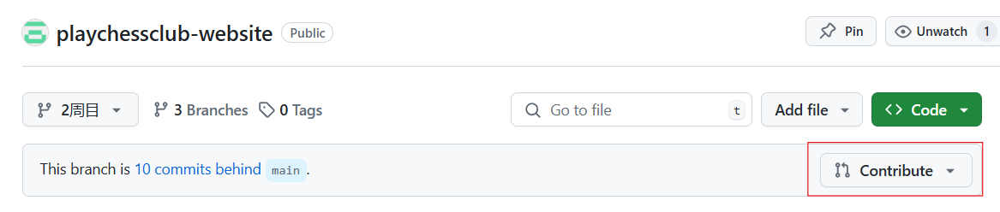

# 欢迎来到pcc官网仓库
[网站](www.mcpcc.fun)
## 编辑教程
1. 点击右上角的`fork`克隆到自己的仓库
2. 在仓库里编辑代码
3. 编辑完后出现如下图片
   
4. 点击如图所示的按钮
5. 点击`pull request`
6. 按照说明发送请求
## 提出建议
[提建议网址](https://github.com/73410/playchessclub-website/issues)
点击`new issue`来创建
